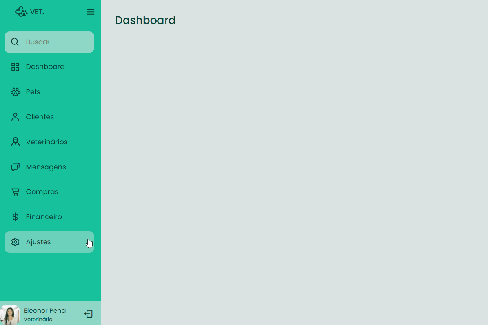

<h1 align="center">
  Responsive Sidebar VET. - Desktop
</h1>

Acesse em: https://sidebar-menu-vet.netlify.app/

## 💻 Projeto

O Responsive Sidebar VET. é um projeto desenvolvido por mim baseado em um desafio da escola RocketSeat. Basicamente é uma página para Desktop que contém um Sidebar Menu
com uma dinâmica interessante, no caso é para um sistema de gerenciamento de uma clínica veterinária. Pode ser facilmente adaptado para qualquer outro segmento. 

<h2>Desktop</h2>

  

## 🚀 Tecnologias

Esse projeto foi desenvolvido com as seguintes tecnologias:

- HTML
- CSS
- JavaScript

Bibliotecas

- [Google Fonts](https://fonts.google.com/)
- [Boxicons](https://boxicons.com/)
- [ScreenToGif](https://www.screentogif.com/)

